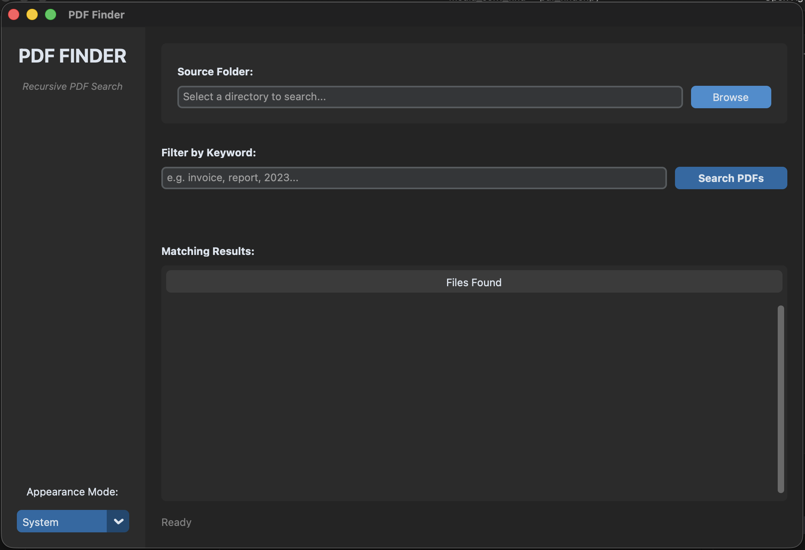
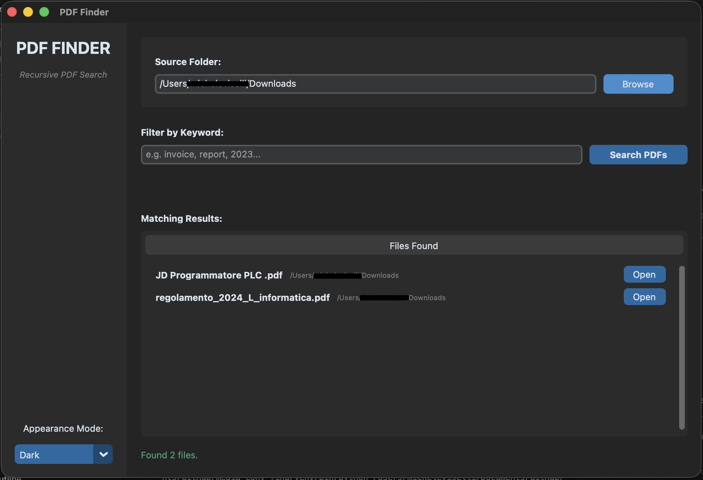
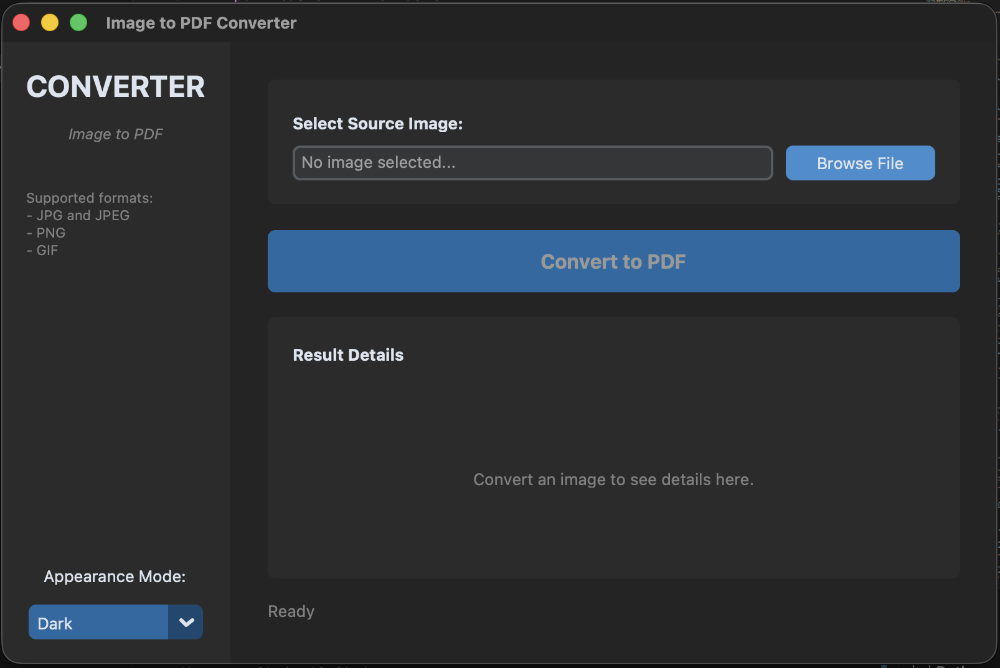
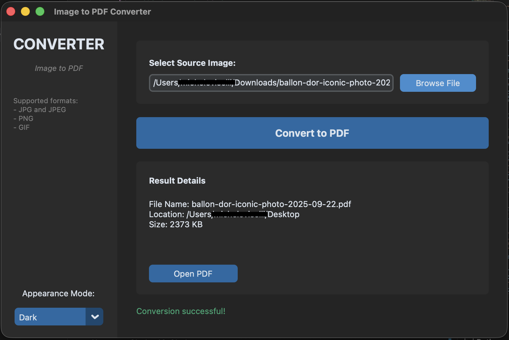

# Media Converter and Finder

Desktop utilities for file lookup and image conversion, built with Python and CustomTkinter.

## Included Tools
- `pdf_finder.py`: searches a selected directory recursively and lists matching PDF files.
- `jpg_to_pdf.py`: converts a single image file (`.jpg`, `.jpeg`, `.png`, `.gif`) to PDF.

## Requirements
- Python 3.10 or later
- `tkinter`, usually included with desktop Python distributions
- Dependencies listed in `requirements.txt`

## Installation
```bash
git clone https://github.com/micheleviselli/media_conv_find.git
cd media_conv_find
python3 -m venv .venv
source .venv/bin/activate
pip install -r requirements.txt
```

On Windows, activate the virtual environment with:

```bash
.venv\Scripts\activate
```

## Usage
Run either application directly:

```bash
python3 pdf_finder.py
python3 jpg_to_pdf.py
```

### PDF Finder




1. Select the folder to scan.
2. Optionally enter a keyword to filter by filename.
3. Click `Search PDFs`.
4. Open a result with the corresponding `Open` button.

### Image to PDF




1. Select an image file.
2. Click `Convert to PDF`.
3. The PDF is saved to the Desktop when available, otherwise to the current working directory.
4. Open the generated file from the result panel.

## Notes
- The PDF search matches `.pdf` files regardless of extension case.
- If no keyword is provided, the PDF finder lists all PDF files found in the selected folder.
- Existing PDF outputs are preserved by generating a unique filename when necessary.

## Platform Support
- Windows
- macOS
- Linux

## License
Released under the MIT License. See [LICENSE](LICENSE).
